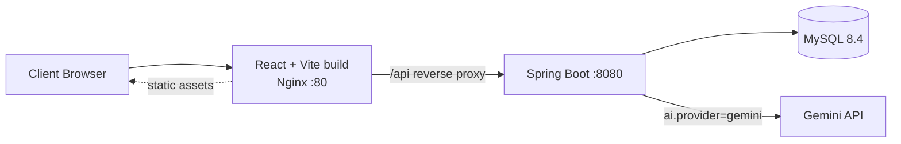
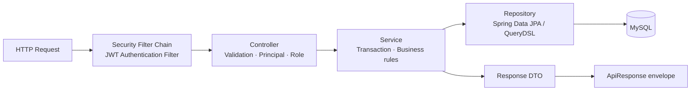
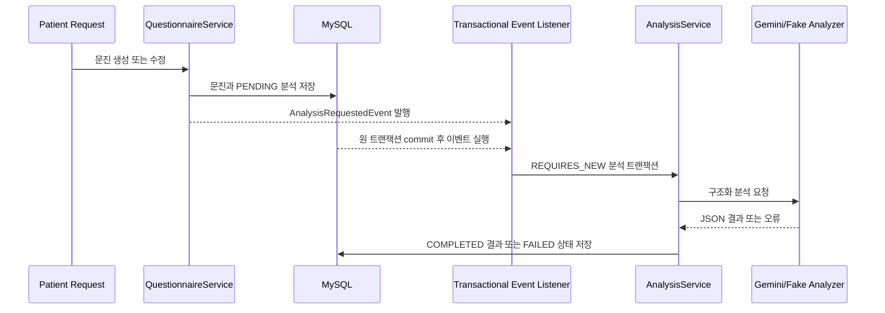
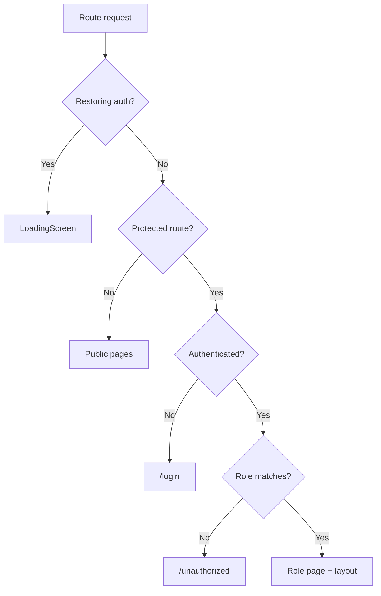
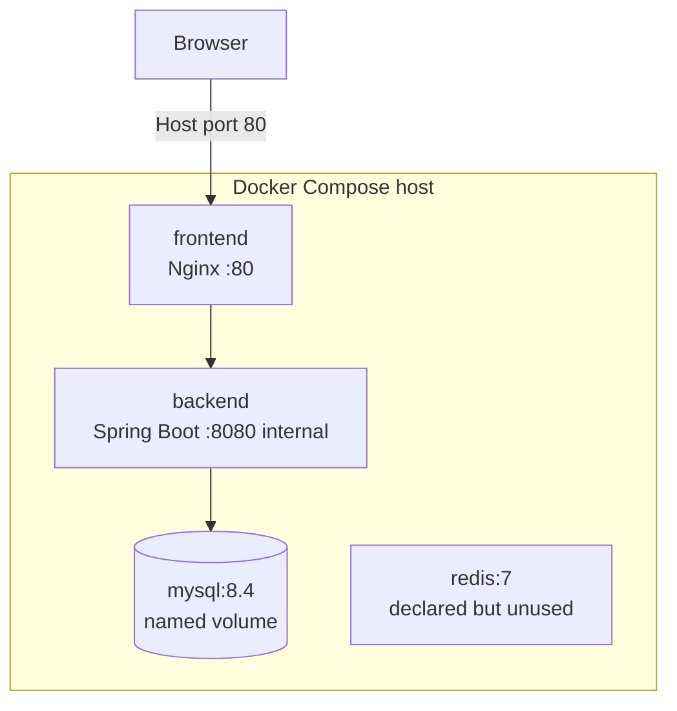

# MedFlow 아키텍처

> 기준일: 2026-08-20  
> 저장소의 애플리케이션 코드, Dockerfile, `docker-compose.yml`, GitHub Actions만을 근거로 작성했다.

## 1. 시스템 구성



Docker Compose의 Nginx는 SPA 정적 파일을 제공하고 `/api/` 요청을 `backend:8080`으로 프록시한다. 개발 환경에서는 프론트의 `VITE_API_BASE_URL`이 가리키는 백엔드에 Axios가 직접 요청한다.

Compose에는 Redis 7도 실행되지만 애플리케이션에서 연결하지 않는다. Spring Data Redis 의존성, Redis client, cache/session/token 저장 코드가 없으므로 위 런타임 흐름에는 포함하지 않았다.

## 2. Backend

### 2.1 애플리케이션 구조

백엔드는 도메인별 패키지를 우선하는 계층형 구조다.

```text
com.medflow
├─ auth            # 인증 Controller/Service, JWT, Security principal, 가입 DTO
├─ user            # User Entity와 관리자 사용자 조회
├─ patient         # Patient 프로필
├─ doctor          # Doctor, DoctorSchedule, 공개/의사/관리자 서비스
├─ hospital        # Hospital 공개 조회와 관리자 관리
├─ reservation     # 예약, QueryDSL 검색, 의사 수동 완료
├─ questionnaire   # 문진, 분석 상태, 이벤트, Gemini/Fake adapter
├─ token           # RefreshToken
└─ common          # 설정, 공통 응답, 예외, 보안 진입점, BaseEntity
```

`BackendApplication`은 JPA Auditing을 활성화한다. 의존성 방향은 일반적으로 Controller → Service → Repository → Entity이며, 응답은 Entity가 아닌 DTO로 변환한다.

### 2.2 Backend Request Flow



#### Controller

- `/api/v1` 아래의 REST Endpoint를 제공한다.
- `@Valid`, `@RequestParam`, `@PathVariable`, `@AuthenticationPrincipal`을 통해 입력과 인증 사용자를 받는다.
- 역할 API는 클래스 수준 `@PreAuthorize`로 제한한다.
- 업무 로직을 Service에 위임하고 `ApiResponse<T>`를 반환한다.
- 현재 `PatientController.updatePatientProfile`에는 `@Valid`가 빠져 있어 DTO의 Bean Validation이 적용되지 않는 예외가 있다.

#### Service

- 트랜잭션 경계, 소유권/담당 관계 확인, 상태 전이의 순서를 담당한다.
- 조회 메서드는 `@Transactional(readOnly = true)`를 사용한다.
- 환자 예약, 의사 담당 예약, 문진 접근은 인증된 `userId`에서 프로필을 찾은 뒤 관계를 검증한다.
- 상태 변경 자체는 `Doctor`, `DoctorSchedule`, `Reservation`, `QuestionnaireAnalysis`의 도메인 메서드에 위임한다.

#### Repository

- 단순 CRUD와 조건 조회는 Spring Data JPA 메서드 이름 쿼리를 사용한다.
- 환자·의사·관리자 예약 검색은 QueryDSL로 동적 조건, Fetch Join, 페이지 조회를 구현한다.
- 의사의 예약 완료 처리에는 담당 의사 조건과 Pessimistic Write Lock을 사용한다.
- 예약 생성 경로는 현재 슬롯에 Lock을 걸지 않으며 예약 테이블에도 슬롯 UNIQUE 제약이 없다.

#### Domain / Entity

- 주요 Aggregate 경계는 사용자 프로필, 의사 슬롯, 예약, 문진/분석이다.
- 연관관계는 LAZY가 기본이고 `open-in-view=false`이므로 Service 트랜잭션 안에서 DTO를 만든다.
- `BaseEntity`는 `createdAt`, `updatedAt`, `deletedAt`과 soft delete 동작을 제공한다.
- `DoctorSchedule`만 `BaseEntity`를 상속하지 않아 감사 시각이 없다.

#### DTO

- 요청/응답 DTO를 분리하고 Entity를 Controller 응답으로 직접 반환하지 않는다.
- 목록 API는 도메인별 Page Response로 Spring `Page`의 핵심 메타데이터만 노출한다.
- Backend DTO와 Frontend `src/types`가 별도 관리되므로 API 변경 시 두 위치를 함께 맞춰야 한다.

#### Security

- 세션, Form Login, HTTP Basic, CSRF를 사용하지 않는 JWT Stateless 방식이다.
- `JwtAuthenticationFilter`가 Bearer Access Token을 검증하고 이메일로 사용자를 다시 조회해 `SecurityContext`를 구성한다.
- 역할은 JWT의 `auth` claim과 현재 DB 사용자에서 만든 `ROLE_PATIENT`, `ROLE_DOCTOR`, `ROLE_ADMIN` 권한으로 판단한다.
- 공개 경로는 회원가입·로그인·재발급·Swagger와 병원/의사 공개 GET API다.
- 비밀번호는 BCrypt로 해시한다.
- Access Token은 60분, Refresh Token은 14일이며 Refresh Token 원문을 MySQL에 저장한다.

#### Exception

- `BusinessException`이 중앙 `ErrorCode`를 보유한다.
- `GlobalExceptionHandler`가 비즈니스 오류, 403, Bean Validation, JSON/파라미터 오류를 `ApiResponse.fail`로 변환한다.
- 인증 실패는 `CustomAuthenticationEntryPoint`가 HTTP 401 / `AUTH_007`로 응답한다.
- 예기치 않은 예외는 내부 상세를 숨긴 HTTP 500 공통 응답으로 처리한다.

### 2.3 문진 분석 흐름



`@TransactionalEventListener(AFTER_COMMIT)`은 원문 저장과 분석 트랜잭션을 분리하지만 `@Async`는 사용하지 않는다. 즉 별도 메시지 큐나 백그라운드 worker가 아니라 같은 애플리케이션 프로세스의 이벤트 호출 흐름이다. 실패는 원문 저장을 되돌리지 않고 `FAILED` 상태로 남긴다.

## 3. Frontend

### 3.1 React 구조

```text
src/
├─ api/         # Axios client와 도메인별 HTTP 함수
├─ auth/        # AuthContext, JWT payload 해석, localStorage
├─ features/    # React Query key/hook와 예약 컴포넌트
├─ pages/       # URL 단위 화면
├─ routes/      # Routes와 인증·역할 guard
├─ layouts/     # 공개/PATIENT/DOCTOR/ADMIN navigation
├─ components/  # 공통 loading/error/분석 표시
└─ types/       # API 계약 TypeScript 타입
```

`main.tsx`에서 `QueryClientProvider` → `AuthProvider` → `BrowserRouter` 순으로 Context를 구성한다.

### 3.2 API Client

- `VITE_API_BASE_URL`을 필수로 읽고 Axios base URL로 사용한다.
- 모든 성공 응답에서 `ApiResponse.data`를 꺼내며 실패 envelope는 `ApiError`로 바꾼다.
- 인증 요청에는 localStorage의 Access Token을 Bearer 헤더로 붙인다.
- 401을 받으면 동시 재발급 요청을 하나의 Promise로 합쳐 토큰을 회전하고 원 요청을 한 번 재시도한다.
- 재발급도 실패하면 인증 만료 이벤트를 발생시켜 토큰, 사용자 상태, React Query cache를 비운다.

### 3.3 React Query

- 기능별 key factory를 사용해 병원, 의사, 예약, 문진, 관리자 데이터를 구분한다.
- 기본 stale time은 60초이고 401/403은 재시도하지 않는다. 그 외 조회는 최대 두 번 시도한다.
- Mutation 성공 후 관련 목록을 무효화하거나 상세 cache를 직접 갱신한다.
- 문진 분석이 `PENDING`/`PROCESSING`이면 3초 간격으로 polling한다.

### 3.4 Routing과 역할 접근



- 공개: 로그인, 회원가입, 병원 목록/상세, 의사 상세
- `PATIENT`: 내 예약, 문진, 프로필, 탈퇴
- `DOCTOR`: 대시보드, 프로필, 진료/예약 관리, 문진 분석
- `ADMIN`: 대시보드, 병원, 예약, 사용자, 의사 관리

프론트 가드는 사용성 경계이고 보안 경계는 아니다. URL을 직접 호출해도 백엔드 `@PreAuthorize`와 Service 소유권 검증이 최종 판단한다.

## 4. Database

### 4.1 MySQL

- Docker Compose 기준 MySQL 8.4를 사용한다.
- `dev`: `DDL_AUTO` 기본 `update`
- `prod`: `DDL_AUTO` 기본 `validate`
- `test`: `create-drop`
- 모든 환경에서 `open-in-view=false`

저장소에 DB migration 도구나 버전별 DDL이 없으므로 `prod=validate`에서 필요한 스키마를 누가 언제 생성·변경하는지는 코드만으로 확인할 수 없다.

### 4.2 데이터 접근 구조

- 사용자 역할별 프로필은 1:0..1 UNIQUE FK로 분리한다.
- 병원 → 의사 → 슬롯 → 예약을 따라 진료 공급 측 정보를 연결한다.
- 환자 → 예약 → 문진 → 분석을 따라 진료 준비 정보를 연결한다.
- 다중 조건 예약 검색은 QueryDSL Fetch Join으로 화면에 필요한 병원·의사·환자를 한 쿼리 흐름에서 읽는다.
- 문진 분석의 문자열 목록은 별도 Element Collection 테이블 세 개에 저장한다.

상세 컬럼과 제약은 [ERD.md](ERD.md)를 참조한다.

## 5. External Service

### Gemini API

- `AI_PROVIDER=gemini`일 때만 Google Gen AI `Client`와 `GeminiQuestionnaireAnalyzer`가 활성화된다.
- `GEMINI_API_KEY`, `GEMINI_MODEL`을 설정에서 주입한다.
- 시스템 지침은 진단·처방·사실 생성 금지와 보수적인 요약을 요구한다.
- JSON schema로 `summary`, `keyFindings`, `riskSignals`, `doctorCheckpoints`, `priorityLevel`을 강제한다.
- `AI_PROVIDER=fake` 또는 provider 미지정 조건에서는 외부 호출 없는 `FakeQuestionnaireAnalyzer`가 사용된다. 다만 공통 설정의 환경변수 placeholder는 실행 환경에 맞게 제공하는 것이 안전하다.

## 6. Deployment

### 6.1 컨테이너 구성



- Backend Dockerfile: Gradle JDK 21 builder → Eclipse Temurin 21 JRE
- Frontend Dockerfile: Node 20 builder → Nginx Alpine
- MySQL과 Redis 데이터는 named volume을 사용한다.
- Backend는 MySQL/Redis healthcheck 통과 뒤 시작하도록 선언되어 있지만 Redis에 실제로 연결하지 않는다.
- 외부에 공개된 Compose port는 Frontend/Nginx의 80뿐이며 Backend는 내부 DNS `backend:8080`으로 접근한다.

### 6.2 CI/CD

GitHub Actions는 `main` push와 pull request에서 다음을 실행한다.

1. MySQL 8.4 서비스와 test profile로 백엔드 테스트
2. 테스트를 제외한 백엔드 build
3. Node 24에서 프론트 `npm ci`, lint, build
4. `main` push일 때만 GitHub Secrets의 EC2 host/user/key로 SSH 접속
5. 원격 `~/medflow-ai`에서 `git pull origin main`, `docker compose up -d --build`

EC2 사용은 workflow에서 확인되지만 VPC, Load Balancer, RDS, S3, Route 53, TLS termination, 보안 그룹 같은 AWS 인프라 구성 파일은 저장소에 없다. 따라서 이 문서는 해당 서비스를 사용한다고 추정하지 않는다. `docs/assets/medflow-aws-deployment-architecture.png`도 현재 배포 설정의 근거 문서로 연결하지 않는다.

## 7. 확인된 아키텍처 경계와 주의점

- Redis 컨테이너는 선언만 되어 있어 현재 시스템 동작에 필요하지 않다.
- Refresh Token은 서비스가 사용자당 하나를 기대하지만 DB UNIQUE는 `token`에만 있고 `user_id`에는 없다.
- 슬롯 예약은 상태 필드로 단일 예약을 표현하지만 DB FK UNIQUE 또는 생성 시 Lock이 없다.
- Soft delete는 전역 필터가 아니므로 공개 조회가 상태와 사용자 활성 조건을 빠뜨리지 않도록 주의해야 한다.
- 프론트 타입의 `ReservationStatus`에는 백엔드에 없는 `PENDING`, `REJECTED`가 남아 있다.
- 일부 URL은 trailing slash를 포함한다. 현재 프론트와 Controller는 이에 맞춰 호출하지만 API 경로 일관성 개선 대상이다.
- 운영 프로파일은 스키마를 생성하지 않으므로 별도 스키마 배포 절차가 필요하다.
- 문진 수정 가능 시각, 예약 기간 검색, 일부 토큰 시각 변환은 시스템 기본 시간을 사용해 업무 시간 기준이 완전히 통일되어 있지 않다.

개선 우선순위는 [ROADMAP.md](ROADMAP.md)에 정리한다.
