# MedFlow ERD

> 기준일: 2026-08-20  
> `backend/src/main/java/com/medflow/**/entity`의 JPA 매핑을 직접 기준으로 작성했다. Hibernate가 사용하는 실제 테이블명과 명시된 UNIQUE/FK를 반영한다.

## 1. 관계 개요

```mermaid
erDiagram
    USERS ||--o| PATIENT : "user_id (UNIQUE)"
    USERS ||--o| DOCTOR : "user_id (UNIQUE)"
    USERS ||--o{ REFRESH_TOKEN : "user_id"
    HOSPITALS ||--o{ DOCTOR : "hospital_id"
    DOCTOR ||--o{ DOCTOR_SCHEDULE : "doctor_id"
    PATIENT ||--o{ RESERVATIONS : "patient_id"
    DOCTOR_SCHEDULE ||--o{ RESERVATIONS : "doctor_schedule_id"
    RESERVATIONS ||--o| QUESTIONNAIRES : "reservation_id (UNIQUE)"
    QUESTIONNAIRES ||--o| QUESTIONNAIRE_ANALYSES : "questionnaire_id (UNIQUE)"
    QUESTIONNAIRE_ANALYSES ||--o{ ANALYSIS_KEY_FINDINGS : "analysis_id"
    QUESTIONNAIRE_ANALYSES ||--o{ ANALYSIS_RISK_SIGNALS : "analysis_id"
    QUESTIONNAIRE_ANALYSES ||--o{ ANALYSIS_DOCTOR_CHECKPOINTS : "analysis_id"

    USERS {
        bigint id PK
        varchar_100 email UK
        varchar password
        varchar_20 role
        varchar_20 status
        datetime created_at
        datetime updated_at
        datetime deleted_at
    }

    PATIENT {
        bigint id PK
        bigint user_id FK,UK
        varchar_50 name
        date birth
        varchar_10 gender
        varchar_11 phone
        datetime created_at
        datetime updated_at
        datetime deleted_at
    }

    HOSPITALS {
        bigint id PK
        varchar_100 name UK
        varchar_255 address
        varchar_50 region
        varchar_20 tel
        varchar_20 status
        datetime created_at
        datetime updated_at
        datetime deleted_at
    }

    DOCTOR {
        bigint id PK
        bigint user_id FK,UK
        bigint hospital_id FK
        varchar_50 name
        varchar_30 license_number UK
        varchar_100 specialty
        varchar_1000 introduction
        varchar_20 contact
        varchar status
        datetime created_at
        datetime updated_at
        datetime deleted_at
    }

    DOCTOR_SCHEDULE {
        bigint id PK
        bigint doctor_id FK
        date date
        time start_time
        time end_time
        varchar status
    }

    RESERVATIONS {
        bigint id PK
        bigint patient_id FK
        bigint doctor_schedule_id FK
        varchar status
        datetime created_at
        datetime updated_at
        datetime deleted_at
    }

    QUESTIONNAIRES {
        bigint id PK
        bigint reservation_id FK,UK
        varchar_200 chief_complaint
        datetime symptom_started_at
        text symptom_description
        int pain_level
        decimal_4_1 temperature
        text associated_symptoms
        text medical_history
        text medications
        text allergies
        text additional_note
        datetime created_at
        datetime updated_at
        datetime deleted_at
    }

    QUESTIONNAIRE_ANALYSES {
        bigint id PK
        bigint questionnaire_id FK,UK
        text summary
        varchar_20 priority_level
        varchar_20 status
        datetime created_at
        datetime updated_at
        datetime deleted_at
    }

    ANALYSIS_KEY_FINDINGS {
        bigint analysis_id FK
        varchar_500 key_finding
    }

    ANALYSIS_RISK_SIGNALS {
        bigint analysis_id FK
        varchar_500 risk_signal
    }

    ANALYSIS_DOCTOR_CHECKPOINTS {
        bigint analysis_id FK
        varchar_500 doctor_checkpoint
    }

    REFRESH_TOKEN {
        bigint id PK
        bigint user_id FK
        varchar token UK
        datetime expires_at
        datetime created_at
        datetime updated_at
        datetime deleted_at
    }
```

Mermaid의 `UK` 표기는 코드에 명시된 UNIQUE 제약이다. `DoctorSchedule`의 복합 UNIQUE는 아래 표에 별도로 표시한다.

## 2. Entity 상세

### User (`users`)

| 구분 | 내용 |
| --- | --- |
| PK | `id` (`IDENTITY`) |
| UNIQUE | `email` |
| 주요 컬럼 | `email` NOT NULL, `password` NOT NULL, `role` NOT NULL, `status` NOT NULL |
| 관계 | `Patient.user_id`, `Doctor.user_id`, `RefreshToken.user_id`의 대상 |
| 상태 Enum | `UserRole`: `PATIENT`, `DOCTOR`, `ADMIN`; `UserStatus`: `ACTIVE`, `LOCKED`, `WITHDRAWN` |
| 삭제 | `withdraw()`이 `WITHDRAWN`과 `deleted_at`을 설정한다. |

`User`에는 Patient/Doctor/RefreshToken으로 향하는 역방향 컬렉션 매핑이 없다. 관계는 프로필/토큰 Entity가 소유한다.

### Patient (`patient`)

| 구분 | 내용 |
| --- | --- |
| PK | `id` |
| FK | `user_id` → `users.id`, NOT NULL |
| UNIQUE | `user_id` |
| 주요 컬럼 | `name` varchar(50), `birth`, `gender` varchar(10), `phone` varchar(11): 모두 NOT NULL |
| 관계 | User와 단방향 1:1, Reservation에서 다대일로 참조 |
| 상태 Enum | `Gender`: `MALE`, `FEMALE` |

### Doctor (`doctor`)

| 구분 | 내용 |
| --- | --- |
| PK | `id` |
| FK | `user_id` → `users.id` NOT NULL, `hospital_id` → `hospitals.id` NOT NULL |
| UNIQUE | `user_id`, `license_number` |
| 주요 컬럼 | `name` NOT NULL varchar(50), `license_number` NOT NULL varchar(30), `specialty` varchar(100), `introduction` varchar(1000), `contact` varchar(20), `status` NOT NULL |
| 관계 | User와 단방향 1:1, Hospital과 단방향 N:1, DoctorSchedule에서 N:1로 참조 |
| 상태 Enum | `DoctorStatus`: `PENDING`, `ACTIVE`, `REJECTED` |

의사 가입 시 상태는 `PENDING`이다. `approve()`와 `reject()`는 `PENDING`에서만 호출할 수 있다.

### Hospital (`hospitals`)

| 구분 | 내용 |
| --- | --- |
| PK | `id` |
| UNIQUE | `name` |
| 주요 컬럼 | `name` varchar(100), `address` varchar(255), `region` varchar(50), `tel` varchar(20), `status` varchar(20): 모두 NOT NULL |
| 관계 | Doctor가 `hospital_id`로 참조 |
| 상태 Enum | `HospitalStatus`: `ACTIVE`, `CLOSED` |
| 삭제 | 관리자 삭제는 `CLOSED`와 `deleted_at`을 함께 설정한다. |

### DoctorSchedule (`doctor_schedule`)

| 구분 | 내용 |
| --- | --- |
| PK | `id` |
| FK | `doctor_id` → `doctor.id` |
| UNIQUE | `uk_doctor_schedule_doctor_date_start(doctor_id, date, start_time)` |
| 주요 컬럼 | `date`, `start_time`, `end_time`, `status` |
| 관계 | Doctor와 단방향 N:1, Reservation에서 N:1로 참조 |
| 상태 Enum | `DoctorScheduleStatus`: `AVAILABLE`, `RESERVED` |

Entity 필드와 `@JoinColumn`에 nullable 제약이 명시되지 않아 JPA 매핑만 기준으로는 `doctor_id`, 날짜, 시간, 상태가 nullable이다. Service 생성 경로는 모두 값을 채운다. 또한 이 Entity는 `BaseEntity`를 상속하지 않으므로 감사/삭제 시각 컬럼이 없다.

### Reservation (`reservations`)

| 구분 | 내용 |
| --- | --- |
| PK | `id` |
| FK | `patient_id` → `patient.id` NOT NULL, `doctor_schedule_id` → `doctor_schedule.id` NOT NULL |
| UNIQUE | 없음 |
| 주요 컬럼 | `status` NOT NULL, 감사 컬럼 |
| 관계 | Patient와 N:1, DoctorSchedule과 N:1, Questionnaire에서 1:0..1로 참조 |
| 상태 Enum | `ReservationStatus`: `APPROVED`, `COMPLETED`, `CANCELLED` |

예약 생성 직후 상태는 `APPROVED`이며 별도 승인 대기 상태는 없다. 코드상 슬롯 상태로 한 예약만 허용하려 하지만 `doctor_schedule_id`에 UNIQUE 제약이 없으므로 DB 모델 자체는 한 슬롯에 여러 Reservation 행을 허용한다.

### Questionnaire (`questionnaires`)

| 구분 | 내용 |
| --- | --- |
| PK | `id` |
| FK | `reservation_id` → `reservations.id` NOT NULL |
| UNIQUE | `uk_questionnaire_reservation(reservation_id)` |
| 필수 컬럼 | `chief_complaint` varchar(200), `symptom_started_at`, `symptom_description` TEXT |
| 선택 컬럼 | `pain_level`, `temperature` decimal(4,1), 동반 증상·병력·약·알레르기·메모 TEXT |
| 관계 | Reservation과 단방향 1:1, QuestionnaireAnalysis에서 1:0..1로 참조 |
| 상태 Enum | 없음 |

### QuestionnaireAnalysis (`questionnaire_analyses`)

| 구분 | 내용 |
| --- | --- |
| PK | `id` |
| FK | `questionnaire_id` → `questionnaires.id` NOT NULL |
| UNIQUE | `uk_questionnaire_analysis_questionnaire(questionnaire_id)` |
| 주요 컬럼 | `summary` TEXT, `priority_level` varchar(20), `status` NOT NULL varchar(20) |
| 값 컬렉션 | `questionnaire_analysis_key_findings`, `questionnaire_analysis_risk_signals`, `questionnaire_analysis_doctor_checkpoints` |
| 상태 Enum | `QuestionnaireAnalysisStatus`: `PENDING`, `PROCESSING`, `COMPLETED`, `FAILED`; `PriorityLevel`: `NORMAL`, `CAUTION`, `HIGH_PRIORITY` |

분석 결과 필드는 대기·처리·실패 상태에서 null 또는 빈 컬렉션일 수 있다. `priorityLevel`은 의료진 확인 우선순위이며 진단이나 응급도 판정이 아니다.
세 값 컬렉션은 `List`로 선언되었지만 `@OrderColumn`이 없어 DB에서 항목 순서를 영속 제약으로 보장하지 않는다.

### RefreshToken (`refresh_token`)

| 구분 | 내용 |
| --- | --- |
| PK | `id` |
| FK | `user_id` → `users.id` NOT NULL |
| UNIQUE | `uk_refresh_token_token(token)` |
| 주요 컬럼 | `token` NOT NULL, `expires_at` NOT NULL, 감사 컬럼 |
| 관계 | User와 단방향 N:1 |
| 상태 Enum | 없음 |

Service는 `findByUser(User)`로 사용자당 한 행을 조회·갱신하는 방식이지만 `user_id`에는 UNIQUE 제약이 없다. 따라서 애플리케이션의 “사용자당 하나” 가정이 DB 스키마로 강제되지는 않는다.

## 3. 공통 감사 및 Soft Delete

`User`, `Patient`, `Doctor`, `Hospital`, `Reservation`, `Questionnaire`, `QuestionnaireAnalysis`, `RefreshToken`은 `BaseEntity`를 상속한다.

| 컬럼 | 의미 | 제약 |
| --- | --- | --- |
| `created_at` | 최초 생성 시각 | NOT NULL, 수정 불가 |
| `updated_at` | 마지막 수정 시각 | NOT NULL |
| `deleted_at` | soft delete 시각 | nullable |

`deleted_at`이 존재한다고 자동으로 모든 쿼리에서 제외되는 것은 아니다. `@Where`, Hibernate Filter, 공통 Repository 조건이 없으므로 각 공개/업무 조회에서 상태와 활성 사용자 조건을 명시한다.

## 4. 스키마 관련 확인 사항

- 저장소에는 Flyway/Liquibase 또는 버전 관리 DDL이 없다.
- 개발은 Hibernate `ddl-auto=update`, 운영은 기본 `validate`이므로 운영 스키마 생성·변경 절차가 저장소에서 확인되지 않는다.
- Reservation의 슬롯 FK와 RefreshToken의 사용자 FK는 서비스 가정과 달리 UNIQUE가 아니다.
- DoctorSchedule의 필수값과 컬렉션 테이블 원소의 NOT NULL/PK가 명시적으로 강제되지 않는다.
- Entity 관계에는 cascade remove/orphan removal이 설정되어 있지 않다. 삭제는 상태와 `deleted_at` 중심으로 처리한다.
