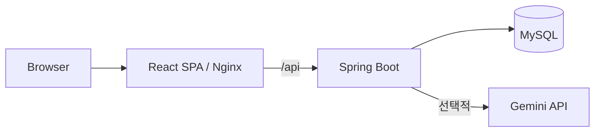

# MedFlow AI

MedFlow는 병원·의사 탐색부터 진료 시간 예약, 사전 문진, 의료진용 AI 문진 요약까지 연결하는 역할 기반 의료 예약 웹 애플리케이션입니다.

AI는 진단이나 처방을 하지 않습니다. 환자가 작성한 문진을 의료진이 빠르게 확인할 수 있도록 요약하고 구조화하는 보조 기능입니다.

## 핵심 기능

- `PUBLIC`: 활성 병원 검색, 승인 의사·예약 가능 시간 조회
- `PATIENT`: 회원가입, 예약·취소, 문진 작성·수정, AI 분석 확인, 프로필 관리
- `DOCTOR`: 승인 기반 가입, 프로필·진료 슬롯 관리, 담당 예약·환자·문진 분석 조회
- `ADMIN`: 병원 관리, 의사 승인·반려, 사용자·예약 조회, 대시보드
- 종료된 승인 예약의 주기적 자동 완료

구현 완료/부분 구현/미구현 범위는 [REQUIREMENTS.md](REQUIREMENTS.md)에 구분되어 있습니다.

## 기술 스택

| 영역 | 기술 |
| --- | --- |
| Backend | Java 21, Spring Boot 3.5.16, Spring Security, Spring Data JPA, QueryDSL |
| Frontend | React 19, TypeScript, Vite, React Router, TanStack React Query, Axios, Tailwind CSS |
| Database | MySQL 8.4 |
| AI | Google Gen AI SDK, Gemini API, 테스트/로컬용 Fake analyzer |
| Delivery | Docker, Docker Compose, Nginx, GitHub Actions, EC2 SSH 배포 |

Docker Compose에 Redis 컨테이너가 선언되어 있지만 현재 애플리케이션 사용 코드는 없습니다.

## 시스템 아키텍처



세부 요청 흐름, 프론트 구조, 컨테이너와 실제 배포 범위는 [ARCHITECTURE.md](ARCHITECTURE.md)를 참고하세요.

## 주요 도메인

`User`를 인증 주체로 두고 `Patient`와 `Doctor` 프로필을 분리합니다. `Doctor`는 `Hospital`에 속하고 `DoctorSchedule`을 생성합니다. 환자는 슬롯을 `Reservation`으로 예약하며, 예약마다 최대 하나의 `Questionnaire`와 `QuestionnaireAnalysis`가 연결됩니다.

관계와 DB 제약은 [ERD.md](ERD.md)에 정리되어 있습니다.

## 실행 방법

### Docker Compose

1. 예제 환경변수 파일을 복사합니다.

```powershell
Copy-Item .env.example .env
```

2. `.env`의 비밀값, DB 정보, Gemini 설정, Frontend API URL을 환경에 맞게 채웁니다.
3. 전체 서비스를 빌드하고 실행합니다.

```powershell
docker compose up -d --build
docker compose ps
```

Frontend는 `http://localhost`에서 열리고 Nginx가 `/api`를 Backend로 전달합니다.

### 로컬 개발

MySQL을 먼저 준비한 뒤 Backend를 실행합니다.

```powershell
Set-Location backend
$env:SPRING_PROFILES_ACTIVE = "dev"
$env:DB_USERNAME = "medflow"
$env:DB_PASSWORD = "your-password"
$env:JWT_SECRET = "your-base64-encoded-hmac-key"
$env:AI_PROVIDER = "fake"
$env:GEMINI_API_KEY = "not-used-in-fake-mode"
$env:GEMINI_MODEL = "configured-model-name"
./gradlew.bat bootRun
```

다른 터미널에서 Frontend를 실행합니다.

```powershell
Set-Location frontend
npm ci
$env:VITE_API_BASE_URL = "http://localhost:8080"
npm run dev
```

개발 API는 기본적으로 `http://localhost:8080`, Vite 화면은 `http://localhost:5173`을 사용합니다.

## 환경변수

| 변수 | 용도 |
| --- | --- |
| `DB_NAME`, `MYSQL_ROOT_PASSWORD` | Docker MySQL 초기화 |
| `DB_URL`, `DB_USERNAME`, `DB_PASSWORD` | Backend DB 연결 |
| `DDL_AUTO` | Hibernate DDL 전략; dev 기본 `update`, prod 기본 `validate` |
| `JWT_SECRET` | Base64 인코딩된 JWT HMAC secret |
| `AI_PROVIDER` | `gemini` 또는 `fake` |
| `GEMINI_API_KEY`, `GEMINI_MODEL` | Gemini 연결 정보 |
| `ADMIN_BOOTSTRAP_ENABLED`, `ADMIN_EMAIL`, `ADMIN_PASSWORD` | 초기 관리자 계정 생성 |
| `VITE_API_BASE_URL` | Frontend가 호출할 API origin |

비밀값은 커밋하지 마세요. 저장소의 `.env.example`은 변수 이름 예시이며 실제 운영 값이 아닙니다.

## 테스트와 검증

Backend:

```powershell
Set-Location backend
$env:SPRING_PROFILES_ACTIVE = "test"
$env:DB_USERNAME = "medflow"
$env:DB_PASSWORD = "testpassword"
$env:JWT_SECRET = "base64-encoded-test-key"
./gradlew.bat test
```

test 프로파일은 `localhost:3306/medflow_test` MySQL과 `create-drop`을 사용합니다.

Frontend:

```powershell
Set-Location frontend
npm ci
npm run lint
npm run build
```

현재 Frontend 자동 테스트 스크립트는 없고 CI는 lint와 build를 검증합니다.

## 프로젝트 구조

```text
backend/                         Spring Boot API와 테스트
  src/main/java/com/medflow/     도메인별 Controller/Service/Repository/Entity/DTO
  src/main/resources/            공통·dev·prod·baseline 설정
frontend/                        React SPA
  src/api/                       HTTP client와 도메인 API
  src/features/                  React Query와 기능 컴포넌트
  src/pages/                     공개·역할별 화면
  src/routes/                    Routing과 인증/역할 guard
.github/workflows/ci-cd.yml      CI와 EC2 배포
docker-compose.yml               Nginx, Backend, MySQL, 미사용 Redis 선언
```

## 주요 기술적 고민

- `open-in-view=false`와 LAZY 관계를 유지하고 Service 안에서 DTO를 구성합니다.
- 예약 검색은 QueryDSL 동적 조건과 Fetch Join으로 목록 조회의 N+1을 줄입니다.
- 문진 원문 저장과 AI 분석 트랜잭션을 분리해 외부 분석 실패가 원문을 되돌리지 않게 합니다.
- 의사 승인, 슬롯 예약, 예약 취소·완료를 Entity 상태 전이로 제한합니다.
- 현재 남은 핵심 과제는 동시 예약의 DB 보장, 운영 스키마 migration, 분석 재시도, 프론트 테스트입니다.

## 상세 문서

- [PROJECT_GUIDE.md](PROJECT_GUIDE.md) — 프로젝트 목적, 원칙, 보안, 테스트 기준
- [REQUIREMENTS.md](REQUIREMENTS.md) — 역할별 실제 구현 상태
- [ARCHITECTURE.md](ARCHITECTURE.md) — Backend/Frontend/DB/외부 서비스/배포 구조
- [ERD.md](ERD.md) — Entity 관계, 컬럼, 제약, Enum
- [API.md](API.md) — 실제 Controller 기준 API 명세
- [ROADMAP.md](ROADMAP.md) — 완료 범위와 근거 기반 개선 과제
