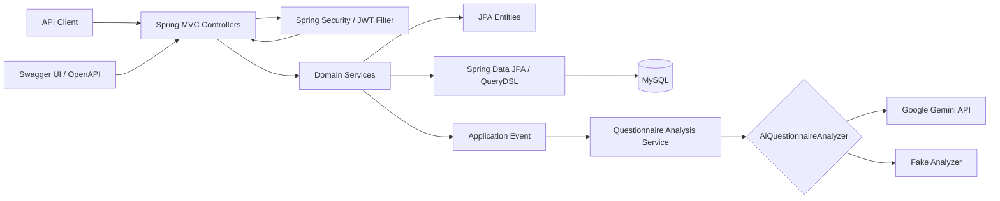
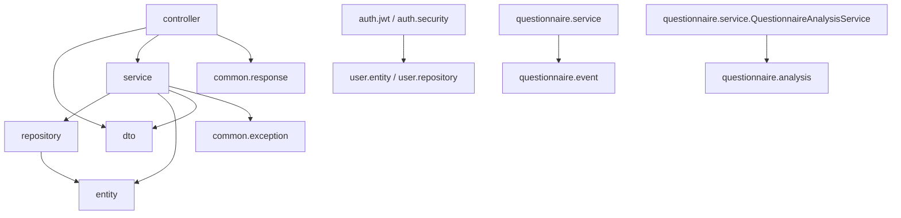
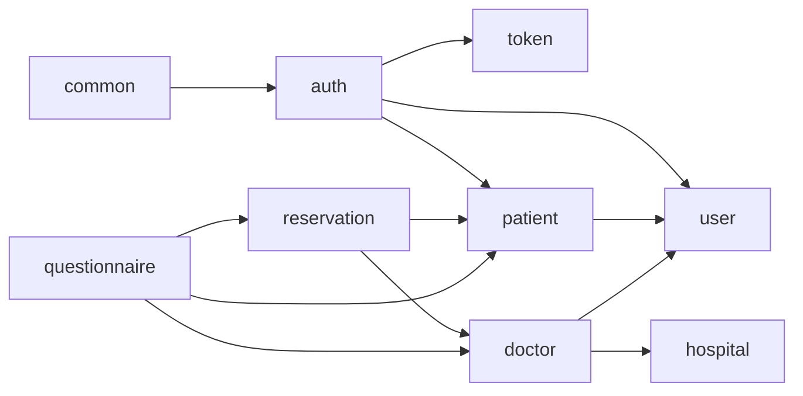
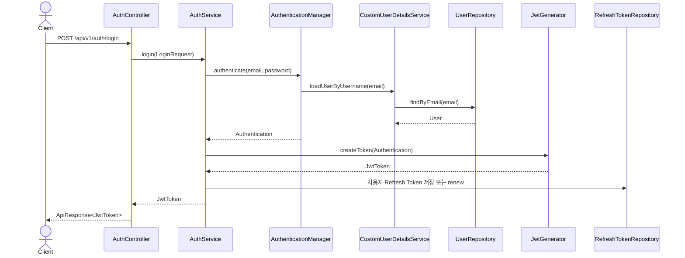
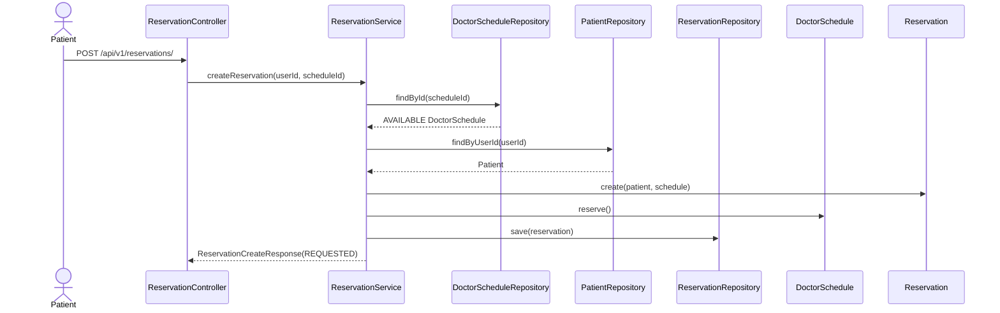
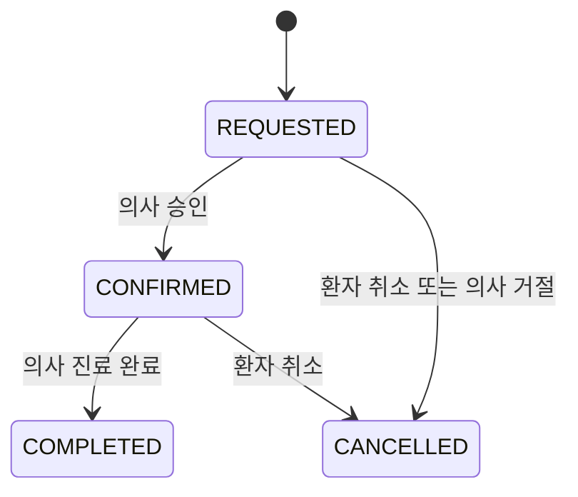
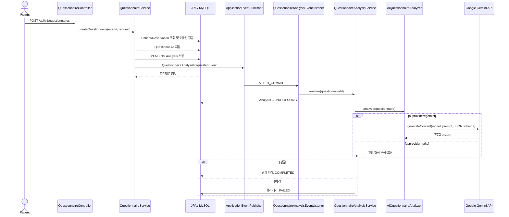
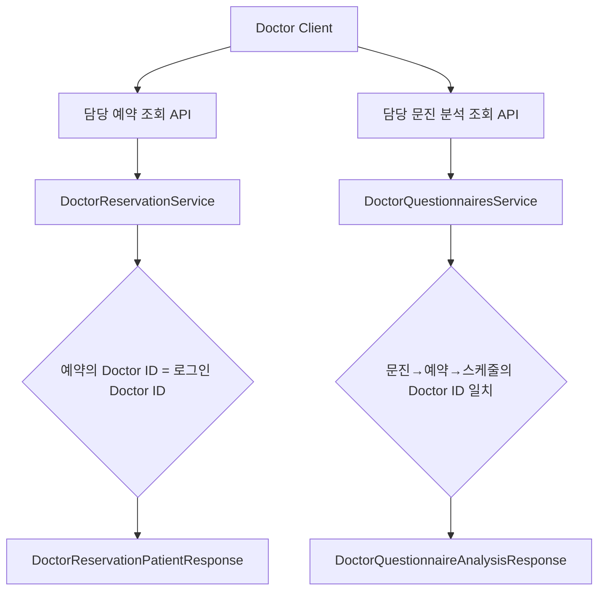

# MedFlow AI 아키텍처

> 기준일: 2026-08-04  
> 이 문서는 현재 실행 코드의 구성과 호출 관계만 설명한다.

## 1. 전체 시스템 구성

MedFlow AI 백엔드는 단일 Spring Boot 프로세스와 MySQL을 중심으로 구성된 모듈러 모놀리스다. HTTP API, 인증/인가, 비즈니스 서비스, JPA 영속성, AI 어댑터가 한 애플리케이션 안에 있다.

Docker Compose에는 Redis가 존재하지만 애플리케이션 의존 관계에는 연결되어 있지 않다.

## 2. 패키지 및 계층 의존 관계

### 기능 모듈

- `auth`: 인증과 JWT
- `token`: Refresh Token 영속화
- `user`: 사용자 계정
- `patient`: 환자 프로필
- `hospital`: 병원
- `doctor`: 의사와 진료 스케줄
- `reservation`: 예약
- `questionnaire`: 문진과 AI 분석
- `common`: 공통 설정, 응답, 예외, 감사 필드

### 계층 방향

Controller는 요청 DTO와 `AuthenticationPrincipal`을 받고 Service를 호출한 뒤 `ApiResponse<T>`를 반환한다. Service는 트랜잭션과 유스케이스를 담당하며, Entity 도메인 메서드로 상태를 변경한다. Repository는 Spring Data JPA를 우선 사용하고 예약의 복합 검색은 QueryDSL 구현체를 사용한다.

### 도메인 간 실제 의존

`AuthService.withdraw`가 Patient와 RefreshToken을 함께 처리하므로 인증 모듈이 환자와 토큰 모듈을 직접 참조한다. Reservation과 Questionnaire는 연관 Entity 조회 및 소유권 검증을 위해 다른 기능 모듈 Repository를 직접 주입한다.

## 3. 인증 흐름

### 로그인 및 토큰 저장

### 인증된 요청

1. `JwtAuthenticationFilter`가 Bearer 토큰을 추출한다.
2. `JwtProvider.validateToken`이 서명, 형식, 만료를 검증한다.
3. `JwtProvider.getAuthentication`이 subject 이메일로 User를 조회한다.
4. `CustomUserDetails`가 `ROLE_PATIENT`, `ROLE_DOCTOR`, `ROLE_ADMIN` 권한을 만든다.
5. Authentication을 SecurityContext에 저장한다.
6. SecurityFilterChain의 인증 정책과 `@PreAuthorize`가 요청을 검사한다.
7. Controller가 `CustomUserDetails.getUserId()`를 Service에 전달한다.

### 토큰 재발급

`AuthService.reissue`는 요청 Refresh Token을 DB에서 조회하고 JWT 유효성, DB 만료 시각, User 활성 상태를 확인한 뒤 Access/Refresh Token을 모두 새로 발급한다. 다만 SecurityConfig에서 재발급 경로가 공개되지 않아 현재 HTTP 호출에는 유효한 Access Token도 필요하다.

## 4. 예약 흐름

예약 상태 전이:

코드상 환자 취소는 `COMPLETED`와 이미 `CANCELLED`인 예약만 거부하므로 `CONFIRMED → CANCELLED`가 가능하다. 취소/거절 시 DoctorSchedule을 `AVAILABLE`로 반환한다.

예약 검색은 다음 QueryDSL Repository로 분리된다.

- `PatientReservationSearchRepository`: 환자, 상태, 날짜, 병원, 의사, 기간
- `DoctorReservationSearchRepository`: 담당 의사, 날짜, 상태
- `AdminReservationSearchRepository`: 병원, 의사, 환자, 날짜, 상태

예약 생성에는 락이나 `doctor_schedule_id` unique 제약이 없어 동시 요청 정합성은 코드로 보장되지 않는다.

## 5. 문진 작성 및 AI 분석 흐름

문진 수정 시 기존 분석을 `PENDING`으로 초기화하고 같은 이벤트로 재분석한다. 이벤트 리스너는 `AFTER_COMMIT`, 분석 서비스는 `REQUIRES_NEW`를 사용해 원문 저장 트랜잭션과 분석 트랜잭션을 분리한다. `@Async` 또는 메시지 브로커가 없으므로 호출 스레드는 분석 실행 동안 계속 사용된다.

## 6. 의사용 통합 조회 흐름

현재 코드에는 단일 “의사용 통합 조회” API가 없다. 의사는 아래 API를 각각 호출한다.

1. 담당 예약 목록/오늘/날짜/검색 API로 예약을 찾는다.
2. `GET /api/v1/doctors/reservations/{reservationId}/patient`로 담당 예약의 환자 프로필을 조회한다.
3. 문진 ID를 알고 있는 경우 `GET /api/v1/doctors/questionnaires/{questionnaireId}/analysis`로 담당 문진 분석을 조회한다.

두 상세 조회 Service는 각각 로그인 User→Doctor를 조회하고, 예약 또는 문진이 해당 Doctor의 스케줄에 연결되어 있는지 검증한다.

예약 조회 응답에는 questionnaireId가 없고 환자 상세 응답에도 문진 정보가 없다. 따라서 현재 API만으로 예약에서 문진 분석까지 연결하는 정확한 클라이언트 흐름은 코드에서 확인되지 않는다.

## 7. 외부 Gemini API 연동 지점

| 구성요소 | 역할 |
|---|---|
| `GeminiProperties` | `gemini.api-key`, `gemini.model` 바인딩 |
| `GeminiConfig` | Google Gen AI `Client` Bean 생성 |
| `AiQuestionnaireAnalyzer` | 분석 공급자 추상화 |
| `GeminiQuestionnaireAnalyzer` | 프롬프트 생성, Gemini 호출, JSON 역직렬화/검증 |
| `GeminiAnalysisResult` | Gemini JSON 응답 모델 |
| `QuestionnaireAnalysisService` | 공급자 호출과 성공/실패 상태 반영 |

`GeminiQuestionnaireAnalyzer`는 `@ConditionalOnProperty(name="ai.provider", havingValue="gemini")`로 선택된다. 모델 기본값은 `application.yml`의 `${GEMINI_MODEL:gemini-3.6-flash}`다. API Key가 없으면 `GEMINI_API_KEY_NOT_CONFIGURED`, 응답 변환/검증 실패는 `AI_ANALYSIS_FAILED` ErrorCode를 사용한다. 실제 분석 서비스는 모든 분석 예외를 잡아 `FAILED` 상태로 저장하므로 이 오류가 문진 생성 HTTP 응답으로 전파되지는 않는다.

## 8. 공통 응답과 예외 경계

성공 응답은 `ApiResponse.success(data)`, 실패 응답은 `ApiResponse.fail(error)`다. 공통 필드는 `success`, `data`, `error`, `timestamp`이며 null 필드는 직렬화에서 제외한다.

`GlobalExceptionHandler`는 다음을 처리한다.

- `AuthorizationDeniedException` → 403 `AUTH_006`
- `BusinessException` → ErrorCode에 정의된 상태
- `MethodArgumentNotValidException` → 400 `VALIDATION_ERROR`
- `MethodArgumentTypeMismatchException` → 400 `VALIDATION_ERROR`
- 그 외 Exception → 500 `INTERNAL_SERVER_ERROR`

JWT 미인증 진입은 `CustomAuthenticationEntryPoint`가 담당한다.

## 코드로 확인한 내용

- 단일 Spring Boot 애플리케이션, MySQL, JPA/QueryDSL 기반 구성
- 기능 패키지 및 계층별 실제 의존 관계
- JWT 로그인/요청/재발급 흐름
- 예약 생성, 상태 전이, 역할별 조회 흐름
- 문진 커밋 후 별도 트랜잭션 분석 흐름
- Gemini 조건부 Bean과 외부 호출 지점
- 의사용 예약/환자/분석 조회가 서로 분리되어 있는 상태

## 작성자 확인이 필요한 내용

- [작성자 확인 필요: 모듈러 모놀리스가 의도된 장기 배포 단위인지]
- [작성자 확인 필요: `/reissue`에 Access Token 인증을 요구하는 것이 의도된 정책인지]
- [작성자 확인 필요: 의사용 통합 조회의 목표 응답 범위와 예약→문진 연결 방식]
- [작성자 확인 필요: Gemini 호출의 목표 timeout, retry, 동시 처리량 및 비용 한도]
- [작성자 확인 필요: Redis의 향후 책임과 애플리케이션 연결 계획]
- [작성자 확인 필요: 운영 DB 스키마 마이그레이션 및 배포 아키텍처]

