# MedFlow AI ERD

> 기준일: 2026-08-05
> 근거: `backend/src/main/java/com/medflow/**/entity`의 JPA annotation과 필드  
> 주의: 물리 컬럼명은 명시된 `@Column`/`@JoinColumn`과 Spring Boot 기본 naming strategy를 기준으로 표기했다. 실제 운영 DB DDL은 저장소에 없다.

## 1. Mermaid ERD

```mermaid
erDiagram
    USERS ||--o| PATIENT : "user_id"
    USERS ||--o| DOCTOR : "user_id"
    USERS ||--o{ REFRESH_TOKEN : "user_id"
    HOSPITAL ||--o{ DOCTOR : "hospital_id"
    DOCTOR ||--o{ DOCTOR_SCHEDULE : "doctor_id"
    PATIENT ||--o{ RESERVATIONS : "patient_id"
    DOCTOR_SCHEDULE ||--o{ RESERVATIONS : "doctor_schedule_id"
    RESERVATIONS ||--o| QUESTIONNAIRES : "reservation_id UNIQUE"
    QUESTIONNAIRES ||--o| QUESTIONNAIRE_ANALYSES : "questionnaire_id UNIQUE"
    QUESTIONNAIRE_ANALYSES ||--o{ ANALYSIS_KEY_FINDINGS : "analysis_id"
    QUESTIONNAIRE_ANALYSES ||--o{ ANALYSIS_RISK_SIGNALS : "analysis_id"
    QUESTIONNAIRE_ANALYSES ||--o{ ANALYSIS_DOCTOR_CHECKPOINTS : "analysis_id"

    USERS {
        bigint id PK
        varchar_100 email UK
        varchar password
        varchar_20 role
        varchar_20 status
        datetime last_login_at
        datetime created_at
        datetime updated_at
        datetime deleted_at
    }

    PATIENT {
        bigint id PK
        bigint user_id FK,UK
        varchar_50 name
        date birth
        varchar_10 gender
        varchar_11 phone
        datetime created_at
        datetime updated_at
        datetime deleted_at
    }

    HOSPITAL {
        bigint id PK
        varchar_100 name UK
        varchar_255 address
        varchar_50 region
        varchar_20 tel
        varchar_20 status
        datetime created_at
        datetime updated_at
        datetime deleted_at
    }

    DOCTOR {
        bigint id PK
        bigint user_id FK,UK
        bigint hospital_id FK
        varchar_50 name
        varchar_30 license_number UK
        varchar_100 specialty
        varchar_1000 introduction
        varchar_20 contact
        varchar status
        datetime created_at
        datetime updated_at
        datetime deleted_at
    }

    DOCTOR_SCHEDULE {
        bigint id PK
        bigint doctor_id FK
        date date
        time start_time
        time end_time
        varchar status
    }

    RESERVATIONS {
        bigint id PK
        bigint patient_id FK
        bigint doctor_schedule_id FK
        varchar status
        datetime created_at
        datetime updated_at
        datetime deleted_at
    }

    QUESTIONNAIRES {
        bigint id PK
        bigint reservation_id FK,UK
        varchar_200 chief_complaint
        datetime symptom_started_at
        text symptom_description
        int pain_level
        decimal_4_1 temperature
        text associated_symptoms
        text medical_history
        text medications
        text allergies
        text additional_note
        datetime created_at
        datetime updated_at
        datetime deleted_at
    }

    QUESTIONNAIRE_ANALYSES {
        bigint id PK
        bigint questionnaire_id FK,UK
        text summary
        varchar_20 priority_level
        varchar_20 status
        datetime created_at
        datetime updated_at
        datetime deleted_at
    }

    REFRESH_TOKEN {
        bigint id PK
        bigint user_id FK
        varchar token UK
        datetime expires_at
        datetime created_at
        datetime updated_at
        datetime deleted_at
    }

    ANALYSIS_KEY_FINDINGS {
        bigint analysis_id FK
        varchar_500 key_finding
    }

    ANALYSIS_RISK_SIGNALS {
        bigint analysis_id FK
        varchar_500 risk_signal
    }

    ANALYSIS_DOCTOR_CHECKPOINTS {
        bigint analysis_id FK
        varchar_500 doctor_checkpoint
    }
```

## 2. 공통 필드

`BaseEntity`를 상속하는 Entity는 다음 필드를 가진다.

| 필드 | Java 타입 | 제약/동작 |
|---|---|---|
| `createdAt` | `LocalDateTime` | `@CreatedDate`, null 불가, 수정 불가 |
| `updatedAt` | `LocalDateTime` | `@LastModifiedDate`, null 불가 |
| `deletedAt` | `LocalDateTime` | nullable, `softDelete()` 호출 시 현재 시각 |

상속 Entity: `User`, `Patient`, `Hospital`, `Doctor`, `Reservation`, `Questionnaire`, `QuestionnaireAnalysis`, `RefreshToken`.

`DoctorSchedule`은 `BaseEntity`를 import하지만 상속하지 않으므로 공통 감사/삭제 필드가 없다.

## 3. 실제 Entity 목록과 필드

### User

- 클래스: `com.medflow.user.entity.User`
- 테이블: `users`

| 필드 | 타입 | 제약 |
|---|---|---|
| `id` | `Long` | PK, IDENTITY |
| `email` | `String` | NOT NULL, UNIQUE, length 100 |
| `password` | `String` | NOT NULL |
| `role` | `UserRole` | STRING enum, NOT NULL, length 20 |
| `status` | `UserStatus` | STRING enum, NOT NULL, length 20 |
| `lastLoginAt` | `LocalDateTime` | nullable |
| 공통 감사 필드 |  | BaseEntity |

### Patient

- 클래스: `com.medflow.patient.entity.Patient`
- 테이블: `patient`

| 필드 | 타입 | 제약 |
|---|---|---|
| `id` | `Long` | PK, IDENTITY |
| `user` | `User` | 1:1 LAZY, `user_id` NOT NULL UNIQUE FK |
| `name` | `String` | NOT NULL, length 50 |
| `birth` | `LocalDate` | NOT NULL |
| `gender` | `Gender` | STRING enum, NOT NULL, length 10 |
| `phone` | `String` | NOT NULL, length 11 |
| 공통 감사 필드 |  | BaseEntity |

### Hospital

- 클래스: `com.medflow.hospital.entity.Hospital`
- 테이블: `hospital`

| 필드 | 타입 | 제약 |
|---|---|---|
| `id` | `Long` | PK, IDENTITY |
| `name` | `String` | NOT NULL, UNIQUE, length 100 |
| `address` | `String` | NOT NULL, length 255 |
| `region` | `String` | NOT NULL, length 50 |
| `tel` | `String` | NOT NULL, length 20 |
| `status` | `HospitalStatus` | STRING enum, NOT NULL, length 20 |
| 공통 감사 필드 |  | BaseEntity |

### Doctor

- 클래스: `com.medflow.doctor.entity.Doctor`
- 테이블: `doctor`

| 필드 | 타입 | 제약 |
|---|---|---|
| `id` | `Long` | PK, IDENTITY |
| `user` | `User` | 1:1 LAZY, `user_id` NOT NULL UNIQUE FK |
| `hospital` | `Hospital` | N:1 LAZY, `hospital_id` NOT NULL FK |
| `name` | `String` | NOT NULL, length 50 |
| `licenseNumber` | `String` | NOT NULL, UNIQUE, length 30 |
| `specialty` | `String` | nullable, length 100 |
| `introduction` | `String` | nullable, length 1000 |
| `contact` | `String` | nullable, length 20 |
| `status` | `DoctorStatus` | STRING enum, NOT NULL |
| 공통 감사 필드 |  | BaseEntity |

Department 연관관계는 코드가 주석 처리되어 있어 현재 Entity 관계가 아니다.

### DoctorSchedule

- 클래스: `com.medflow.doctor.entity.DoctorSchedule`
- 테이블: 기본 naming에 따른 `doctor_schedule`

| 필드 | 타입 | 제약 |
|---|---|---|
| `id` | `Long` | PK, IDENTITY |
| `doctor` | `Doctor` | N:1 LAZY, `doctor_id` FK; nullable 미지정 |
| `date` | `LocalDate` | nullable 미지정 |
| `startTime` | `LocalTime` | nullable 미지정 |
| `endTime` | `LocalTime` | nullable 미지정 |
| `status` | `DoctorScheduleStatus` | STRING enum; nullable 미지정 |

의사/날짜/시작시각 중복은 Service의 `existsByDoctorIdAndDateAndStartTime`으로 검사하지만 테이블 unique constraint는 없다.

### Reservation

- 클래스: `com.medflow.reservation.entity.Reservation`
- 테이블: `reservations`

| 필드 | 타입 | 제약 |
|---|---|---|
| `id` | `Long` | PK, IDENTITY |
| `patient` | `Patient` | N:1 LAZY, `patient_id` NOT NULL FK |
| `doctorSchedule` | `DoctorSchedule` | N:1 LAZY, `doctor_schedule_id` NOT NULL FK |
| `status` | `ReservationStatus` | STRING enum, NOT NULL |
| 공통 감사 필드 |  | BaseEntity |

코드는 스케줄 상태를 `RESERVED`로 바꿔 스케줄당 한 예약을 의도하지만 `doctor_schedule_id` unique constraint는 없다.

### Questionnaire

- 클래스: `com.medflow.questionnaire.entity.Questionnaire`
- 테이블: `questionnaires`

| 필드 | 타입 | 제약 |
|---|---|---|
| `id` | `Long` | PK, IDENTITY |
| `reservation` | `Reservation` | 1:1 LAZY, `reservation_id` NOT NULL UNIQUE FK |
| `chiefComplaint` | `String` | NOT NULL, length 200 |
| `symptomStartedAt` | `LocalDateTime` | NOT NULL |
| `symptomDescription` | `String` | NOT NULL, TEXT |
| `painLevel` | `Integer` | nullable |
| `temperature` | `BigDecimal` | nullable, precision 4 scale 1 |
| `associatedSymptoms` | `String` | nullable, TEXT |
| `medicalHistory` | `String` | nullable, TEXT |
| `medications` | `String` | nullable, TEXT |
| `allergies` | `String` | nullable, TEXT |
| `additionalNote` | `String` | nullable, TEXT |
| 공통 감사 필드 |  | BaseEntity |

### QuestionnaireAnalysis

- 클래스: `com.medflow.questionnaire.entity.QuestionnaireAnalysis`
- 테이블: `questionnaire_analyses`

| 필드 | 타입 | 제약 |
|---|---|---|
| `id` | `Long` | PK, IDENTITY |
| `questionnaire` | `Questionnaire` | 1:1 LAZY, `questionnaire_id` NOT NULL UNIQUE FK |
| `summary` | `String` | nullable, TEXT |
| `keyFindings` | `List<String>` | ElementCollection, 원소 length 500 |
| `riskSignals` | `List<String>` | ElementCollection, 원소 length 500 |
| `doctorCheckpoints` | `List<String>` | ElementCollection, 원소 length 500 |
| `priorityLevel` | `PriorityLevel` | STRING enum, nullable, length 20 |
| `status` | `QuestionnaireAnalysisStatus` | STRING enum, NOT NULL, length 20 |
| 공통 감사 필드 |  | BaseEntity |

ElementCollection 테이블:

- `questionnaire_analysis_key_findings(analysis_id, key_finding)`
- `questionnaire_analysis_risk_signals(analysis_id, risk_signal)`
- `questionnaire_analysis_doctor_checkpoints(analysis_id, doctor_checkpoint)`

### RefreshToken

- 클래스: `com.medflow.token.entity.RefreshToken`
- 테이블: `refresh_token`

| 필드 | 타입 | 제약 |
|---|---|---|
| `id` | `Long` | PK, IDENTITY |
| `user` | `User` | N:1 LAZY, `user_id` NOT NULL FK |
| `token` | `String` | NOT NULL, table unique constraint `uk_refresh_token_token` |
| `expiresAt` | `LocalDateTime` | NOT NULL |
| 공통 감사 필드 |  | BaseEntity |

Service는 `findByUser(user)`로 사용자당 한 Refresh Token을 갱신하지만 `user_id`에는 DB unique constraint가 없다.

## 4. 연관관계와 다중성 요약

| From | To | JPA 관계 | DB 기준 다중성 | 비고 |
|---|---|---|---|---|
| Patient | User | `@OneToOne` | User 1 : Patient 0..1 | `user_id` unique |
| Doctor | User | `@OneToOne` | User 1 : Doctor 0..1 | `user_id` unique |
| RefreshToken | User | `@ManyToOne` | User 1 : Token 0..N | 서비스는 1개를 의도 |
| Doctor | Hospital | `@ManyToOne` | Hospital 1 : Doctor 0..N |  |
| DoctorSchedule | Doctor | `@ManyToOne` | Doctor 1 : Schedule 0..N |  |
| Reservation | Patient | `@ManyToOne` | Patient 1 : Reservation 0..N |  |
| Reservation | DoctorSchedule | `@ManyToOne` | Schedule 1 : Reservation 0..N | unique 없음 |
| Questionnaire | Reservation | `@OneToOne` | Reservation 1 : Questionnaire 0..1 | table unique |
| QuestionnaireAnalysis | Questionnaire | `@OneToOne` | Questionnaire 1 : Analysis 0..1 | table unique |

모든 연관관계는 자식→부모 단방향이다. Entity에 `@OneToMany` 컬렉션은 없다. Cascade와 orphanRemoval도 선언되어 있지 않다.

## 5. FK 및 Unique 제약조건

### 명시된 FK

- `patient.user_id → users.id`
- `doctor.user_id → users.id`
- `doctor.hospital_id → hospital.id`
- `doctor_schedule.doctor_id → doctor.id`
- `reservations.patient_id → patient.id`
- `reservations.doctor_schedule_id → doctor_schedule.id`
- `questionnaires.reservation_id → reservations.id`
- `questionnaire_analyses.questionnaire_id → questionnaires.id`
- `refresh_token.user_id → users.id`
- 분석 ElementCollection의 `analysis_id → questionnaire_analyses.id`

### 명시된 Unique

- `users.email`
- `patient.user_id`
- `hospital.name`
- `doctor.user_id`
- `doctor.license_number`
- `questionnaires.reservation_id` (`uk_questionnaire_reservation`)
- `questionnaire_analyses.questionnaire_id` (`uk_questionnaire_analysis_questionnaire`)
- `refresh_token.token` (`uk_refresh_token_token`)

## 6. 주요 Enum

| Enum | 값 |
|---|---|
| `UserRole` | `PATIENT`, `DOCTOR`, `ADMIN` |
| `UserStatus` | `ACTIVE`, `LOCKED`, `WITHDRAWN` |
| `Gender` | `MALE`, `FEMALE` |
| `HospitalStatus` | `ACTIVE`, `INACTIVE`, `CLOSED` |
| `DoctorStatus` | `PENDING`, `ACTIVE`, `REJECTED` |
| `DoctorScheduleStatus` | `AVAILABLE`, `RESERVED`, `BLOCKED` |
| `ReservationStatus` | `APPROVED`, `COMPLETED`, `CANCELLED` |
| `ReservationPeriod` | `UPCOMING`, `TODAY`, `PAST` (검색 DTO용, Entity 필드 아님) |
| `QuestionnaireAnalysisStatus` | `PENDING`, `PROCESSING`, `COMPLETED`, `FAILED` |
| `PriorityLevel` | `NORMAL`, `CAUTION`, `HIGH_PRIORITY` |

## 7. 삭제 정책

`BaseEntity.softDelete()`는 `deletedAt`을 기록하고 `isDeleted()`를 제공한다.

실제 삭제 동작:

- 회원 탈퇴: User를 `WITHDRAWN`으로 변경하고 User `deletedAt` 기록. 연결된 Patient가 있으면 Patient `deletedAt` 기록. Refresh Token은 물리 삭제.
- 병원 삭제 API: Hospital을 `CLOSED`로 변경하고 `deletedAt` 기록.
- 의사 신청 취소: `doctorRepository.delete(doctor)`를 호출하는 물리 삭제.
- 로그아웃/만료 Refresh Token: Repository delete를 통한 물리 삭제.

Entity에 `@SQLDelete`, `@SQLRestriction`, `@Where`가 없다. Repository 조회에도 공통 `deletedAt is null` 조건이 없으므로 soft delete된 행이 기본 `findById`/`findAll`에서 자동 제외되지 않는다. ADR-002의 전역 soft delete 방향은 현재 코드에 완전히 구현되어 있지 않다.

## 코드로 확인한 내용

- 9개 JPA Entity와 3개 ElementCollection 테이블
- 각 Entity 필드, Java 타입, nullable/length/precision annotation
- 모든 FK 방향과 실제 JPA 다중성
- 명시된 unique constraint
- 9개 주요 Enum과 예약 검색용 Enum
- BaseEntity 감사 필드와 실제 soft/hard delete 호출 지점

## 작성자 확인이 필요한 내용

- [작성자 확인 필요: 실제 운영 DB DDL과 인덱스 구성]
- [작성자 확인 필요: User당 Refresh Token을 DB에서도 1개로 제한할지]
- [작성자 확인 필요: DoctorSchedule당 Reservation을 DB에서도 1개로 제한할지]
- [작성자 확인 필요: DoctorSchedule nullable 컬럼과 감사 필드 정책]
- [작성자 확인 필요: 모든 주요 Entity에 적용할 최종 Soft Delete 조회/복구 정책]
- [작성자 확인 필요: 의사 신청 취소의 물리 삭제가 의도된 것인지]
- [작성자 확인 필요: Department 도메인의 도입 여부와 관계]
