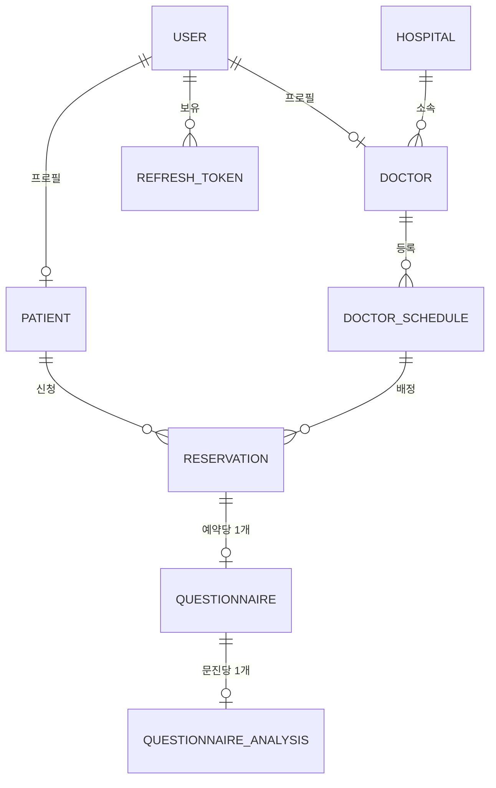

# MedFlow AI 프로젝트 현황

> 분석 기준: 2026-08-04 현재 `backend/src/main`, `backend/src/test`, Gradle 설정, 실행 설정 및 ADR의 실제 코드
>
> 범위 원칙: **구현 완료**는 현재 코드에 실행 경로가 존재하는 기능만 뜻한다. **개선 후보/로드맵**은 구현 현황과 분리한 제안이며, 구현되었다는 의미가 아니다.

### 검증 현황

- 실행 명령: `backend/gradlew.bat test --no-daemon`
- 결과: **110개 중 106개 통과, 4개 실패 — 전체 빌드 실패**
- 실패 내역:
  - `BackendApplicationTests.contextLoads`: 테스트 컨텍스트의 Hibernate dialect 결정 실패
  - `DoctorQuestionnairesServiceTest`: Mockito `UnfinishedStubbingException` 1건, `UnnecessaryStubbingException` 2건
- 따라서 아래 기능 목록은 코드상 실행 경로의 구현 여부를 뜻하며, 현재 브랜치 전체가 테스트 통과 상태라는 뜻은 아니다.

## 1. 프로젝트 개요

MedFlow AI는 환자, 의사, 병원 관리자 사이의 진료 예약과 사전 문진을 지원하는 Spring Boot 기반 백엔드 API다. 현재 코드는 회원 인증, 환자/의사/병원 정보 관리, 의사 스케줄과 예약 상태 관리, 문진 작성 및 Gemini 기반 문진 요약을 제공한다.

- 단일 Spring Boot 애플리케이션인 모듈러 모놀리스 형태다.
- 기능별 패키지 구조를 사용한다.
- JWT 기반 무상태 인증과 역할 기반 메서드 권한 검사를 사용한다.
- MySQL을 운영 데이터베이스로, H2를 테스트 데이터베이스로 사용한다.
- AI 분석은 `ai.provider` 설정에 따라 Gemini 또는 Fake 구현체를 선택한다.
- 프론트엔드, 진료 기록, 알림, 결제, Redis 연동 코드는 현재 저장소에 없다.

## 2. 기술 스택

| 구분 | 실제 적용 기술 |
|---|---|
| 언어/런타임 | Java 21 |
| 프레임워크 | Spring Boot 3.5.16 |
| 웹 | Spring MVC, Bean Validation |
| 보안 | Spring Security, JWT(JJWT 0.11.5), BCrypt |
| 데이터 접근 | Spring Data JPA, Hibernate, QueryDSL 5.1.0 |
| 데이터베이스 | MySQL 8.4, 테스트용 H2 |
| AI | Google Gen AI SDK 1.64.0, Gemini 구성 가능 |
| API 문서 | springdoc-openapi / Swagger UI 2.8.16 |
| 빌드 | Gradle Wrapper |
| 보일러플레이트 | Lombok |
| 테스트 | JUnit 5, Spring Boot Test, Spring Security Test, Mockito |
| 로컬 인프라 | Docker Compose: MySQL 8.4, Redis 7 |

참고: Redis 컨테이너 정의는 있으나 Redis 의존성이나 사용 코드는 없다.

## 3. 프로젝트 구조

```text
medflow-ai/
├── backend/
│   ├── build.gradle
│   ├── gradlew, gradlew.bat
│   └── src/
│       ├── main/
│       │   ├── java/com/medflow/
│       │   │   ├── auth, token, user, patient
│       │   │   ├── hospital, doctor, reservation
│       │   │   ├── questionnaire
│       │   │   └── common
│       │   └── resources/
│       └── test/
├── docker/
├── docs/adr/
├── docker-compose.yml
└── README.md
```

애플리케이션은 기능별 최상위 패키지 아래에 `controller`, `service`, `repository`, `entity`, `dto` 등을 두는 구조다. 공통 응답, 예외, 보안 및 설정은 `common`에 모여 있다.

## 4. 도메인 구조

| 도메인 | 핵심 모델 | 책임 |
|---|---|---|
| 인증 | User, RefreshToken | 가입, 로그인, 토큰 발급/재발급/폐기, 탈퇴 |
| 사용자 | User | 이메일, 암호화 비밀번호, 역할, 계정 상태 |
| 환자 | Patient | 사용자와 연결된 환자 프로필 |
| 병원 | Hospital | 병원 기본 정보와 운영 상태 |
| 의사 | Doctor, DoctorSchedule | 의사 자격 신청/승인 및 진료 시간 슬롯 |
| 예약 | Reservation | 환자-의사 스케줄 연결과 예약 상태 전이 |
| 문진 | Questionnaire | 예약별 1개의 사전 문진 |
| AI 분석 | QuestionnaireAnalysis | 문진 요약, 핵심 내용, 위험 신호, 확인 사항, 우선순위 |

주요 상태 모델은 다음과 같다.

- User: `ACTIVE`, `LOCKED`, `WITHDRAWN`
- Hospital: `ACTIVE`, `INACTIVE`, `CLOSED`
- Doctor: `PENDING`, `ACTIVE`, `REJECTED`
- DoctorSchedule: `AVAILABLE`, `RESERVED`, `BLOCKED`
- Reservation: `REQUESTED`, `CONFIRMED`, `COMPLETED`, `CANCELLED`
- QuestionnaireAnalysis: `PENDING`, `PROCESSING`, `COMPLETED`, `FAILED`

## 5. 구현 완료 기능

### 인증 및 계정

- PATIENT/DOCTOR 역할 회원가입 및 이메일 중복 검사
- BCrypt 비밀번호 암호화와 이메일/비밀번호 로그인
- 60분 Access Token, 14일 Refresh Token 발급
- DB에 사용자별 Refresh Token 저장/갱신
- Refresh Token 재발급(rotation), 로그아웃 시 토큰 삭제
- 로그인 계정의 회원 탈퇴 및 관련 Refresh Token 정리
- JWT 필터 인증, 역할 기반 `@PreAuthorize` 검사
- 관리자용 사용자 단건/전체 조회

### 환자 및 병원

- 로그인 사용자 기반 환자 프로필 생성, 조회, 수정
- 관리자용 전체 환자 조회
- 공개 병원 목록(활성 병원)과 병원 상세 조회
- 관리자용 병원 생성, 전체 조회, 수정, 폐쇄/소프트 삭제

### 의사 및 스케줄

- 의사 자격 신청, 신청 상태 프로필 조회/수정, 대기 중 신청 취소
- 관리자용 의사 상태별 목록, 상세 조회, 승인, 반려
- 승인된 의사의 일정 구간을 슬롯 단위로 분할 등록
- 의사별 예약 가능한 스케줄 조회

### 예약

- 환자가 가용 의사 스케줄을 선택해 예약 요청 생성
- 환자 예약 목록의 상태/날짜/병원/의사/기간 조건 검색 및 페이징
- 본인 예약 취소와 스케줄 반환
- 의사 담당 예약 전체/오늘/날짜별 조회
- 의사 담당 예약 조건 검색 및 페이징
- 의사가 담당 예약의 환자 정보 조회
- 의사의 예약 승인, 거절, 진료 완료 처리
- 관리자 전체 예약의 병원/의사/환자/날짜/상태 검색 및 페이징

### 문진 및 AI 분석

- 환자가 본인 예약에 예약당 1개의 문진 생성
- 본인 예약 문진 조회 및 진료 시작 전 수정
- 취소/완료 예약의 문진 생성·수정 제한
- 문진 생성/수정 커밋 후 분석 이벤트 발행
- Gemini 구조화 JSON 분석 또는 Fake 분석 구현체 선택
- 분석 결과에 요약, 핵심 내용, 위험 신호, 의사 확인 사항, 확인 우선순위 저장
- 분석 상태 관리 및 실패 상태 기록
- 환자 본인의 분석 결과 조회
- 담당 의사의 분석 결과 조회

## 6. API 목록

현재 컨트롤러에 선언된 API는 총 **44개**다. 별도 명시가 없으면 JWT 인증이 필요하다.

### 인증/사용자

| Method | Path | 권한 | 기능 |
|---|---|---|---|
| POST | `/api/v1/auth/signup` | 공개 | 회원가입 |
| POST | `/api/v1/auth/login` | 공개 | 로그인 및 토큰 발급 |
| POST | `/api/v1/auth/reissue` | 인증 경로 정책상 필요 | 토큰 재발급 |
| POST | `/api/v1/auth/logout` | 인증 | 로그아웃 |
| DELETE | `/api/v1/auth/withdraw` | 인증 | 로그인 계정 탈퇴 |
| GET | `/api/v1/user/{id}` | ADMIN | 사용자 단건 조회 |
| GET | `/api/v1/user/` | ADMIN | 사용자 전체 조회 |

### 환자/병원

| Method | Path | 권한 | 기능 |
|---|---|---|---|
| POST | `/api/v1/patient/create` | 인증 | 환자 프로필 생성 |
| GET | `/api/v1/patient/profile` | 인증 | 본인 환자 프로필 조회 |
| PUT | `/api/v1/patient/update` | 인증 | 본인 환자 프로필 수정 |
| GET | `/api/v1/patient/` | ADMIN | 전체 환자 조회 |
| GET | `/api/v1/hospitals/` | 인증 | 활성 병원 목록 조회 |
| GET | `/api/v1/hospitals/{hospitalId}` | 인증 | 병원 상세 조회 |
| POST | `/api/v1/admin/hospitals/` | ADMIN | 병원 등록 |
| GET | `/api/v1/admin/hospitals/` | ADMIN | 병원 관리 목록 조회 |
| PUT | `/api/v1/admin/hospitals/{hospitalId}` | ADMIN | 병원 수정 |
| DELETE | `/api/v1/admin/hospitals/{hospitalId}` | ADMIN | 병원 폐쇄/소프트 삭제 |

### 의사/스케줄

| Method | Path | 권한 | 기능 |
|---|---|---|---|
| POST | `/doctor/apply` | DOCTOR | 의사 신청 |
| GET | `/doctor/profile` | 인증 | 자신의 의사 프로필 조회 |
| PATCH | `/doctor/profile` | DOCTOR, ADMIN | 자신의 의사 신청 정보 수정 |
| DELETE | `/doctor/profile` | DOCTOR | 대기 중 의사 신청 취소 |
| GET | `/admin/doctors` | ADMIN | 상태별 의사 목록 조회 |
| GET | `/admin/doctors/{doctorId}` | ADMIN | 의사 상세 조회 |
| PATCH | `/admin/doctors/{doctorId}/approve` | ADMIN | 의사 승인 |
| PATCH | `/admin/doctors/{doctorId}/reject` | ADMIN | 의사 반려 |
| POST | `/api/v1/doctors/schedules` | DOCTOR, ADMIN | 진료 스케줄 슬롯 생성 |
| GET | `/api/v1/doctors/{doctorId}/schedules` | 인증 | 예약 가능 스케줄 조회 |

### 예약

| Method | Path | 권한 | 기능 |
|---|---|---|---|
| POST | `/api/v1/reservations/` | PATIENT | 예약 요청 생성 |
| GET | `/api/v1/reservations/patient` | PATIENT | 환자 예약 검색/페이징 |
| PATCH | `/api/v1/reservations/{reservationId}/cancel` | PATIENT | 본인 예약 취소 |
| GET | `/api/v1/doctors/reservations` | DOCTOR | 담당 예약 전체 조회 |
| GET | `/api/v1/doctors/reservations/today` | DOCTOR | 오늘 담당 예약 조회 |
| GET | `/api/v1/doctors/reservations/date` | DOCTOR | 날짜별 담당 예약 조회 |
| GET | `/api/v1/doctors/reservations/search` | DOCTOR | 담당 예약 검색/페이징 |
| GET | `/api/v1/doctors/reservations/{reservationId}/patient` | DOCTOR | 담당 예약 환자 조회 |
| PATCH | `/api/v1/doctors/reservations/{reservationId}/complete` | DOCTOR | 진료 완료 |
| PATCH | `/api/v1/doctors/reservations/{reservationId}/approve` | DOCTOR | 예약 승인 |
| PATCH | `/api/v1/doctors/reservations/{reservationId}/reject` | DOCTOR | 예약 거절 |
| GET | `/api/v1/admin/reservations` | ADMIN | 전체 예약 검색/페이징 |

### 문진

| Method | Path | 권한 | 기능 |
|---|---|---|---|
| POST | `/api/v1/questionnaires` | PATIENT | 예약 문진 작성 |
| GET | `/api/v1/questionnaires/{reservationId}` | PATIENT | 예약 문진 조회 |
| PUT | `/api/v1/questionnaires/{questionnaireId}` | PATIENT | 문진 수정 및 재분석 요청 |
| GET | `/api/v1/questionnaires/{questionnaireId}/analysis` | PATIENT | 본인 문진 분석 조회 |
| GET | `/api/v1/doctors/questionnaires/{questionnaireId}/analysis` | DOCTOR | 담당 문진 분석 조회 |

주의: `/reissue`는 컨트롤러 기능상 Refresh Token만으로 동작하지만 SecurityConfig의 공개 경로에 포함되지 않아 현재는 Access Token 인증도 요구된다.

## 7. Entity 관계



- User–Patient: 단방향 1:1, `patient.user_id` unique
- User–Doctor: 단방향 1:1, `doctor.user_id` unique
- User–RefreshToken: 단방향 N:1이며 서비스 규칙으로 사용자당 한 토큰을 갱신한다. DB의 `user_id` unique 제약은 없다.
- Hospital–Doctor: N:1
- Doctor–DoctorSchedule: N:1
- Patient–Reservation: N:1
- DoctorSchedule–Reservation: N:1. 스케줄 상태로 단일 예약을 의도하지만 DB unique 제약은 없다.
- Reservation–Questionnaire: 1:1 unique
- Questionnaire–QuestionnaireAnalysis: 1:1 unique
- 분석 결과의 세 목록은 `@ElementCollection` 별도 테이블에 저장된다.

`BaseEntity` 상속 엔티티에는 `createdAt`, `updatedAt`, `deletedAt`이 있다. 예외적으로 `DoctorSchedule`은 `BaseEntity`를 import하지만 상속하지 않는다.

## 8. 패키지 구조와 역할

| 패키지 | 역할 |
|---|---|
| `auth` | 인증 API/서비스, Spring UserDetails, JWT 생성·검증·필터 |
| `token` | Refresh Token 엔티티와 저장소 |
| `user` | 계정 엔티티, 관리자 사용자 조회 |
| `patient` | 환자 프로필 CRUD와 관리자 조회 |
| `hospital` | 병원 사용자 조회 및 관리자 CRUD |
| `doctor` | 의사 신청/승인, 프로필, 진료 스케줄 |
| `reservation` | 환자·의사·관리자 예약 유스케이스와 QueryDSL 검색 |
| `questionnaire` | 문진 CRUD, 분석 이벤트, AI 어댑터, 분석 결과 조회 |
| `common.config` | Security, Swagger, QueryDSL, Gemini 설정 |
| `common.entity` | 감사 필드와 소프트 삭제 기반 클래스 |
| `common.exception` | ErrorCode, BusinessException, 전역 예외 처리 |
| `common.response` | 공통 성공/실패 응답 포맷 |
| `common.init` | dev 프로필 초기 데이터 생성 |

## 9. 현재 아키텍처

현재 구조는 **기능 기반 패키징을 적용한 계층형 모듈러 모놀리스**다.

```text
HTTP 요청
  → SecurityFilterChain / JwtAuthenticationFilter
  → Controller (인증 사용자 ID 추출, DTO 검증, ApiResponse 포장)
  → Service (@Transactional 유스케이스 및 소유권 검사)
  → Entity (상태 전이와 핵심 불변식)
  → Spring Data JPA / QueryDSL Repository
  → MySQL
```

문진 분석은 애플리케이션 이벤트를 사용해 원본 저장 트랜잭션과 분석 트랜잭션을 분리한다. `AFTER_COMMIT` 리스너에서 `REQUIRES_NEW` 분석을 수행한다. 다만 `@Async`나 외부 큐가 없으므로 호출 스레드 기준으로는 비동기 처리가 아니다.

외부 AI는 `AiQuestionnaireAnalyzer` 인터페이스 뒤에 `GeminiQuestionnaireAnalyzer`와 `FakeQuestionnaireAnalyzer`를 두어 설정 기반으로 교체한다.

## 10. 데이터 흐름

### 로그인

1. 이메일/비밀번호를 AuthenticationManager로 검증한다.
2. 사용자 권한을 포함한 Access Token과 Refresh Token을 생성한다.
3. Refresh Token과 만료 시각을 DB에 저장 또는 갱신한다.
4. 이후 요청에서 JWT 필터가 토큰을 검증하고 이메일로 User를 다시 조회해 SecurityContext를 구성한다.

### 예약

1. 환자가 `AVAILABLE` 스케줄 ID로 예약을 요청한다.
2. 로그인 User에서 Patient를 조회한다.
3. Reservation을 `REQUESTED`로 만들고 스케줄을 `RESERVED`로 바꾼다.
4. 담당 의사는 자신의 Doctor ID와 연결된 예약만 승인/거절/완료할 수 있다.
5. 환자 취소 또는 의사 거절 시 스케줄을 `AVAILABLE`로 반환한다.

### 문진과 AI 분석

1. 환자와 예약 소유권, 예약 상태를 검증한다.
2. Questionnaire와 `PENDING` QuestionnaireAnalysis를 저장한다.
3. 커밋 후 분석 이벤트를 처리한다.
4. 분석을 `PROCESSING`으로 바꾸고 선택된 AI 어댑터를 호출한다.
5. 성공하면 구조화 결과와 `COMPLETED`, 실패하면 빈 결과와 `FAILED`를 저장한다.
6. 환자는 본인 예약, 의사는 담당 예약 관계를 검증한 뒤 결과를 조회한다.

## 11. 현재 프로젝트의 장점

- 기능 중심 패키지로 도메인 응집도가 높고 향후 모듈 분리가 쉽다.
- Controller가 Entity를 반환하지 않고 요청/응답 DTO와 `ApiResponse`를 사용한다.
- 로그인 사용자 ID를 요청에서 받지 않고 `AuthenticationPrincipal`에서 가져오는 핵심 흐름이 적용돼 있다.
- 예약, 스케줄, 의사 승인 상태 전이를 Entity 메서드에 배치했다.
- 주요 변경 유스케이스가 트랜잭션 경계 안에 있고 조회에는 다수의 `readOnly` 설정이 있다.
- 예약과 문진에서 환자/의사 소유권을 조회 조건 또는 서비스 검증으로 제한한다.
- 복합 예약 검색을 QueryDSL 저장소로 분리하고 페이징 응답을 제공한다.
- AI 제공자를 인터페이스와 조건부 Bean으로 분리해 테스트/개발 대체가 가능하다.
- AI 프롬프트에 진단·처방 금지, 입력 외 사실 생성 금지 규칙이 명시돼 있다.
- 문진 저장과 AI 실패를 분리하여 외부 AI 장애가 문진 원본 저장을 롤백하지 않는다.
- 예약/문진 서비스, 컨트롤러 권한, AI 분석 및 이벤트 리스너 테스트가 존재한다.

## 12. 개선이 필요한 부분

아래는 현재 코드에서 직접 확인되는 문제 또는 설계-구현 간 차이다.

### 우선순위 높음

1. **Refresh Token 재발급 경로 정책 불일치**: `/api/v1/auth/reissue`가 공개 경로가 아니어서 만료된 Access Token만 가진 사용자는 재발급 API에 접근할 수 없다.
2. **예약 동시성 보장 부족**: 스케줄 상태 조회 후 변경하는 방식이며 비관/낙관 락, 스케줄 FK unique 제약이 없다. 동시 요청에서 중복 예약 가능성을 DB 수준에서 차단하지 못한다.
3. **소프트 삭제 일관성 부족**: ADR은 주요 Entity의 삭제 데이터 제외를 결정했지만 `@SQLRestriction`, 공통 조회 조건 등이 없다. `findAll`/`findById`가 삭제된 User/Hospital을 다시 조회할 수 있다.
4. **역할 경계가 일부 느슨함**: 환자 프로필 생성/조회/수정은 인증만 요구하여 DOCTOR/ADMIN도 호출할 수 있다. 반대로 스케줄 생성은 ADMIN을 허용하지만 항상 현재 사용자 ID로 Doctor를 찾으므로 일반 관리자 계정에는 실효성이 없다.
5. **의사 신청 취소가 물리 삭제**: `doctorRepository.delete`를 사용하여 Soft Delete ADR과 다르고 연관 데이터가 생기면 삭제 제약 위험이 있다.

### 우선순위 중간

6. API 경로가 `/api/v1/...`, `/doctor/...`, `/admin/...`로 혼재하고 단수/복수 및 trailing slash가 일관되지 않다.
7. 모든 성공 응답이 컨트롤러 반환 기본값인 HTTP 200이며 생성 API의 201, 삭제/무응답의 204 등 상태 코드 구분이 없다.
8. 환자 DTO 요청에 `@Valid` 적용이 없고, 저장소 전체 검토 기준 일부 입력 검증 정책이 DTO별로 일관되지 않다.
9. User/Hospital/Patient/Doctor의 관리자 전체 목록이 페이징 없이 `findAll()`을 사용한다.
10. `DoctorSchedule`만 감사 필드를 상속하지 않으며 컬럼 nullable, 중복 슬롯 DB 제약도 명시되지 않았다.
11. Refresh Token은 서비스상 사용자당 하나지만 DB unique 제약이 없어 경쟁 상황에서 복수 행이 생길 수 있다.
12. `spring.jpa.hibernate.ddl-auto=update`가 기본 및 dev에 사용돼 운영 스키마 변경 이력 관리가 없다.
13. 기본 프로필이 dev로 활성화되어 있고 DB/JWT/Gemini 환경변수 누락 시 애플리케이션 구동이 환경에 강하게 의존한다.
14. Docker Compose의 Redis는 실제 애플리케이션에서 사용되지 않는다.
15. README가 사실상 비어 있어 실행 방법, 환경변수, API 진입점이 문서화되어 있지 않다.
16. 현재 전체 테스트에서 4건이 실패하므로 CI 통과 가능한 기준선이 아니다.

## 13. 리팩터링 후보

> 다음 항목은 **미구현 제안**이다.

- API base path를 `/api/v1` 아래로 통일하고 리소스명을 복수형으로 정리한다. 기존 클라이언트를 위해 단계적 호환 전략이 필요하다.
- 사용자 역할별 프로필 접근 정책을 Controller 클래스 수준 `@PreAuthorize`로 명확히 한다.
- `BaseEntity` 소프트 삭제 정책을 실제 조회 필터와 복구/관리자 조회 정책까지 포함해 일관되게 적용한다.
- 물리 삭제 중인 의사 신청 취소를 상태/소프트 삭제 기반으로 통일한다.
- DoctorSchedule의 감사 필드 및 중복 슬롯 불변식을 Entity/DB 양쪽에 정리한다.
- 사용자당 Refresh Token 관계를 실제 1:1 모델과 unique constraint로 맞춘다.
- `deleteResponse` 클래스명을 Java 네이밍 규칙에 맞게 변경하되 API 직렬화 호환성을 검증한다.
- 중복되는 사용자→Patient/Doctor 조회 및 소유권 검증을 도메인별 private helper 또는 정책 컴포넌트로 정리한다.
- ErrorCode와 HTTP 상태 매핑, 생성/수정/삭제 응답 상태 규칙을 일관화한다.
- 운영/개발/테스트 설정을 분리하고 비밀값 및 기본 profile 정책을 명확히 한다.

## 14. 성능 개선 후보

> 다음 항목은 **미구현 제안**이다. 실제 트래픽 측정 후 적용 우선순위를 확정해야 한다.

- 예약 생성에 비관적 락 또는 낙관적 락과 DB unique constraint를 적용해 정합성과 동시 처리 안전성을 확보한다.
- 예약 목록 DTO 변환에서 Patient→User, Schedule→Doctor→Hospital 접근에 대한 N+1 여부를 SQL 로그로 계측하고 QueryDSL fetch join/projection을 적용한다.
- 관리자 사용자·환자·병원·의사 목록에 Pageable과 최대 page size를 적용한다.
- 예약 검색 조건과 정렬에 맞춰 `doctor_schedule(date, doctor_id, status)`, `reservation(patient_id, status)`, 연관 FK/검색 컬럼의 복합 인덱스를 실행계획 기반으로 설계한다.
- JWT 요청마다 이메일로 User를 조회하는 비용을 측정하고, 토큰 폐기/계정 상태 반영 요구와 균형을 고려해 캐시 전략을 검토한다.
- Gemini 호출을 요청 스레드 밖의 비동기 실행기 또는 내구성 있는 작업 큐로 분리하고 timeout/retry/backoff/멱등성을 추가한다.
- AI 분석 목록 ElementCollection 조회 패턴을 측정하고 필요 시 fetch 전략 또는 단일 구조화 컬럼 사용을 검토한다.
- 개발 SQL debug 로깅은 운영 profile에서 비활성화한다.

## 15. 향후 개발 로드맵

이 로드맵은 현재 구현 완료 기능과 분리된 **제안**이며, 코드에 구현된 계획을 서술한 것이 아니다.

### Sprint 1 — 보안과 데이터 정합성

- Refresh Token 재발급 접근 정책 수정 및 인증 테스트 추가
- 환자/의사/관리자 API 역할 경계 정비
- 예약 중복 방지용 락과 DB 제약 도입, 동시성 테스트 추가
- 소프트 삭제 조회 정책 확정 및 User/Hospital/Doctor에 일관 적용
- 입력 검증 누락과 HTTP 상태 코드 정리

### Sprint 2 — 운영 가능한 데이터 계층

- Flyway 또는 Liquibase 기반 스키마 마이그레이션 도입
- 검색/정렬 기준 인덱스와 실행계획 검증
- 관리자 목록 페이징 적용
- 예약 목록 N+1 측정 및 QueryDSL projection/fetch join 개선
- 환경별 설정과 비밀값, 로깅 정책 분리

### Sprint 3 — AI 처리 신뢰성

- AI 분석을 비동기 작업 실행 구조로 분리
- timeout, 제한적 retry/backoff, 멱등 처리 및 재분석 API/운영 절차 정의
- 실패 사유와 요청 추적 ID 등 관측성 추가
- 의료 안전 문구, 개인정보 전송 범위, 모델 응답 검증 강화

### Sprint 4 — 품질과 운영 문서

- 인증/환자/병원/의사 영역의 서비스·컨트롤러 테스트 보강
- Testcontainers 기반 MySQL/동시성 통합 테스트 검토
- OpenAPI 응답/에러 예시와 README 실행 가이드 작성
- CI에서 build/test 및 정적 분석 자동화

## 현재 구현 완료

- [x] Spring Boot/Java 21 백엔드 프로젝트 구성
- [x] JWT 회원가입·로그인·재발급·로그아웃·탈퇴
- [x] 사용자 역할 및 계정 상태 모델
- [x] 환자 프로필 생성·조회·수정과 관리자 조회
- [x] 병원 조회 및 관리자 등록·수정·폐쇄
- [x] 의사 신청·수정·취소와 관리자 승인·반려
- [x] 의사 스케줄 슬롯 생성 및 가용 슬롯 조회
- [x] 환자 예약 생성·검색·취소
- [x] 의사 예약 조회·검색·승인·거절·완료
- [x] 관리자 예약 검색
- [x] 예약 기반 문진 생성·조회·수정
- [x] Gemini/Fake 문진 분석과 분석 상태 저장
- [x] 환자/담당 의사의 분석 결과 조회와 소유권 검증
- [x] 공통 API 응답 및 전역 비즈니스 예외 처리
- [x] Swagger/OpenAPI 구성
- [x] 예약/문진 중심 자동화 테스트 존재

> 자동화 테스트는 존재하지만 현재 전체 실행 결과 110개 중 4개가 실패한다.

## 다음 Sprint에서 해야 할 작업

- [ ] `/api/v1/auth/reissue` 인증 정책과 재발급 시나리오 수정
- [ ] 예약 생성 동시성 제어 및 DB 중복 방지 제약 추가
- [ ] Soft Delete 조회 필터와 의사 신청 취소 정책 일관화
- [ ] 환자·의사·관리자 API의 역할 권한 재점검
- [ ] DTO 입력 검증과 HTTP 상태 코드 일관화
- [ ] 전체 목록 API 페이징 적용
- [ ] 예약 조회 N+1 및 인덱스 실행계획 측정
- [ ] DB 마이그레이션 도구 도입
- [ ] AI 분석의 진짜 비동기화, timeout/retry/멱등성 설계
- [ ] 인증·사용자·환자·병원·의사 테스트 보강
- [ ] README와 환경변수/로컬 실행 가이드 작성
- [ ] 실패 중인 컨텍스트 테스트 1건과 Mockito 테스트 3건 수정
